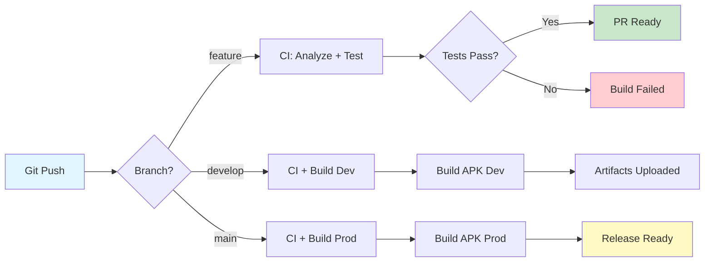

# Flutter CI/CD Practice Project

[](https://github.com/Maksym-Tomusiak/Flutter_CI-CD/actions/workflows/ci.yml)

A comprehensive Flutter application demonstrating **professional CI/CD practices** with automated testing, code quality gates, multi-environment configuration, and automated builds.

## 🚀 Features

- ✅ **Automated CI/CD Pipeline** with GitHub Actions
- 📊 **Code Quality Gates** (analyze, format, coverage 70%+)
- 🌍 **Multi-Environment Setup** (dev, staging, production)
- 🏗️ **Automated Builds** for different environments
- 🧪 **Comprehensive Test Coverage** (70%+ required)
- 🏷️ **Automated Versioning** scripts
- 📝 **Strict Linting Rules** for code quality

## 📋 CI/CD Pipeline Architecture



## 🏗️ Project Structure

```
practice_13/
├── .github/
│   └── workflows/
│       └── ci.yml                 # Main CI/CD workflow
├── lib/
│   ├── config/
│   │   ├── environment.dart       # Environment enum
│   │   └── app_config.dart        # App configuration
│   ├── main_dev.dart              # Dev entry point
│   ├── main_staging.dart          # Staging entry point
│   └── main_prod.dart             # Production entry point
├── test/
│   └── widget_test.dart           # Comprehensive tests
├── scripts/
│   ├── check_coverage.sh          # Coverage validation
│   └── increment_version.sh       # Version bumping
├── analysis_options.yaml          # Strict linter rules
└── pubspec.yaml
```

## 🔧 Environment Configuration

The app supports three environments using Dart's `--dart-define` feature:

### Development Environment

```bash
flutter run --dart-define=BUILD_ENV=dev \
            --dart-define=API_URL=https://api-dev.example.com \
            --dart-define=ENABLE_LOGGING=true \
            --target=lib/main_dev.dart
```

### Staging Environment

```bash
flutter run --dart-define=BUILD_ENV=staging \
            --dart-define=API_URL=https://api-staging.example.com \
            --dart-define=ENABLE_LOGGING=true \
            --target=lib/main_staging.dart
```

### Production Environment

```bash
flutter run --dart-define=BUILD_ENV=prod \
            --dart-define=API_URL=https://api.example.com \
            --dart-define=ENABLE_LOGGING=false \
            --target=lib/main_prod.dart
```

## 🧪 Running Tests

### Run all tests

```bash
flutter test
```

### Run tests with coverage

```bash
flutter test --coverage
```

### Check coverage threshold (70% minimum)

```bash
# On Linux/macOS
bash scripts/check_coverage.sh

# On Windows (Git Bash)
bash scripts/check_coverage.sh
```

### Generate HTML coverage report

```bash
# Install lcov (Linux)
sudo apt-get install lcov

# Generate HTML report
genhtml coverage/lcov.info -o coverage/html

# Open report
open coverage/html/index.html  # macOS
xdg-open coverage/html/index.html  # Linux
start coverage/html/index.html  # Windows
```

## 🔍 Code Quality Checks

### Format check

```bash
dart format --output=none --set-exit-if-changed .
```

### Format fix

```bash
dart format .
```

### Analyze code

```bash
flutter analyze --fatal-infos --fatal-warnings
```

## 🏗️ Building APKs

### Build for Development

```bash
flutter build apk \
  --dart-define=BUILD_ENV=dev \
  --dart-define=API_URL=https://api-dev.example.com \
  --target=lib/main_dev.dart \
  --release
```

### Build for Staging

```bash
flutter build apk \
  --dart-define=BUILD_ENV=staging \
  --dart-define=API_URL=https://api-staging.example.com \
  --target=lib/main_staging.dart \
  --release
```

### Build for Production

```bash
flutter build apk \
  --dart-define=BUILD_ENV=prod \
  --dart-define=API_URL=https://api.example.com \
  --target=lib/main_prod.dart \
  --release
```

## 🤖 GitHub Actions Workflow

The CI/CD pipeline consists of 4 jobs:

### 1. 🔍 Code Analysis

- Checkout code
- Setup Flutter
- Install dependencies
- Verify formatting
- Run static analysis

### 2. 🧪 Run Tests

- Run all tests with coverage
- Check 70% coverage threshold
- Upload coverage reports as artifacts
- Generate HTML coverage report

### 3. 🏗️ Build APK

- Build APKs for all environments (dev, staging, prod)
- Upload APKs as artifacts
- Runs in parallel for each environment

### 4. 📋 Build Summary

- Display pipeline summary
- Always runs (even if previous jobs fail)

## 📊 Code Coverage Requirements

- **Minimum Coverage**: 70%
- **Coverage Check**: Automated via `scripts/check_coverage.sh`
- **CI Integration**: Pipeline fails if coverage < 70%

Current coverage areas:

- ✅ AppConfig class methods
- ✅ BuildEnvironment enum
- ✅ Widget rendering for all environments
- ✅ Theme configuration
- ✅ UI components (InfoCard, HomePage)

## 🔧 Scripts

### Version Increment (`scripts/increment_version.sh`)

Automatically increments build number in `pubspec.yaml`:

```bash
bash scripts/increment_version.sh
```

**Example:**

- Before: `version: 1.0.0+1`
- After: `version: 1.0.0+2`

### Coverage Check (`scripts/check_coverage.sh`)

Validates that code coverage meets the minimum threshold:

```bash
bash scripts/check_coverage.sh
```

**Output:**

```
Current Coverage: 85.5%
Minimum Required: 70%
✅ PASSED: Coverage check successful!
```

## 📝 Linting Rules

Strict linting configuration in `analysis_options.yaml`:

**Code Style:**

- `prefer_single_quotes`
- `prefer_const_constructors`
- `prefer_final_fields`

**Code Organization:**

- `always_use_package_imports`
- `avoid_relative_lib_imports`
- `sort_constructors_first`

**Safety:**

- `avoid_print`
- `cancel_subscriptions`
- `close_sinks`

**Errors:**

- `missing_required_param: error`
- `missing_return: error`

## 🚦 Branch Protection (Recommended)

Configure these settings in GitHub repository settings:

1. **Require pull request reviews**
   - Minimum 1 approval
2. **Require status checks to pass**

   - ✅ analyze job
   - ✅ test job
   - ✅ build job

3. **Require branches to be up to date**

4. **Require linear history** (no merge commits)

## 📦 Artifacts

After each successful pipeline run, the following artifacts are available:

1. **coverage-report** - Raw LCOV coverage data
2. **coverage-html-report** - HTML coverage report
3. **apk-dev** - Development APK
4. **apk-staging** - Staging APK
5. **apk-prod** - Production APK

Artifacts are retained for **30 days**.

## 🎯 Testing the Pipeline

### Local Testing

1. **Run code quality checks:**

```bash
dart format --output=none --set-exit-if-changed .
flutter analyze --fatal-infos
```

2. **Run tests with coverage:**

```bash
flutter test --coverage
bash scripts/check_coverage.sh
```

3. **Build for all environments:**

```bash
# Dev
flutter build apk --dart-define=BUILD_ENV=dev --target=lib/main_dev.dart

# Staging
flutter build apk --dart-define=BUILD_ENV=staging --target=lib/main_staging.dart

# Prod
flutter build apk --dart-define=BUILD_ENV=prod --target=lib/main_prod.dart
```

### Trigger Pipeline

Push to `develop` or `main` branch:

```bash
git add .
git commit -m "feat: add new feature"
git push origin develop
```

Create a Pull Request to trigger the pipeline.

## 📈 Performance Optimizations

- ✅ **Caching**: Flutter SDK and dependencies are cached
- ✅ **Parallel Jobs**: Builds run in parallel for all environments
- ✅ **Artifact Compression**: APKs are compressed for faster upload

## 🐛 Troubleshooting

### Coverage below threshold

```bash
# Run tests to see which files lack coverage
flutter test --coverage
# Add more tests to increase coverage
```

### Format issues

```bash
# Auto-format all files
dart format .
```

### Analysis warnings

```bash
# See detailed analysis
flutter analyze
# Fix issues or add ignores with comments
```

## 📚 Resources

- [Flutter CI/CD Best Practices](https://docs.flutter.dev/deployment/cd)
- [GitHub Actions Documentation](https://docs.github.com/en/actions)
- [Flutter Testing Documentation](https://docs.flutter.dev/testing)
- [Dart Code Style Guide](https://dart.dev/guides/language/effective-dart/style)

## 🤝 Contributing

1. Create a feature branch
2. Make your changes
3. Ensure all tests pass locally
4. Push and create a Pull Request
5. Wait for CI checks to pass
6. Get code review approval
7. Merge to develop/main

## 📄 License

This project is for educational purposes.

---

**Built with ❤️ using Flutter and GitHub Actions**
